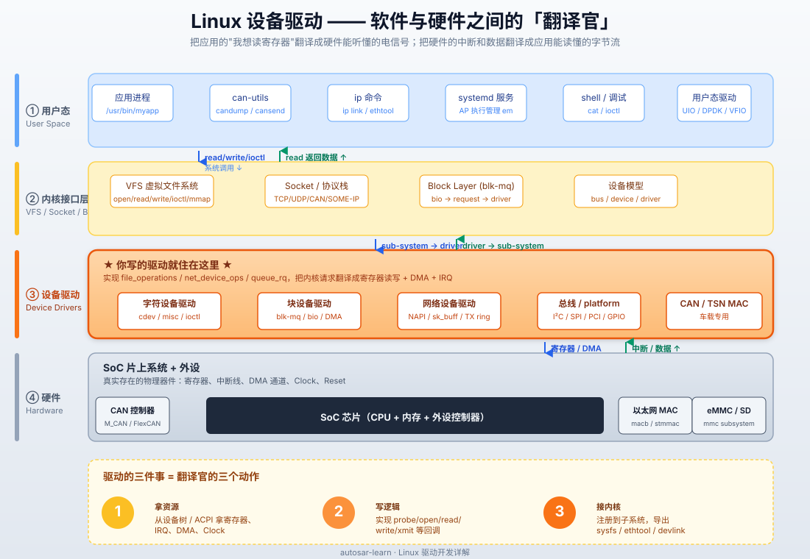

# Linux 驱动开发详解 —— 原理、实战与车载落地

> 面向车载 / AUTOSAR Adaptive Platform 工程师的 Linux 内核驱动手册。
> 字符 / 块 / 网络三大类全覆盖，**原理 + 实战并重**，每章先讲内核机制，再给可编译运行的代码。

---

## 0. 文档定位与阅读路径

### 0.1 为什么在 `autosar-learn` 仓库
AUTOSAR Adaptive Platform（AP）规范要求运行在 **POSIX OS**（主流是 Linux / QNX）。AP 之下的「外设驱动、SocketCAN、车载以太网 MAC、Display、I2C/SPI 传感器」全部由 Linux 内核提供。因此**掌握 Linux 驱动开发是从 CP / 应用层进入 AP 底层与中间件的必经之路**。

### 0.2 阅读路径建议
| 你现在要做什么 | 推荐章节 |
|---|---|
| 第一次接触内核模块 | 1 → 2 → 3.1 |
| 写第一个真正可用的字符驱动 | 3 整章 |
| 适配一块开发板 / SoC | 4 → 5 |
| 写网卡 / CAN 驱动 | 10 → 12 |
| 写块设备（NVMe 类/eMMC 类） | 9 |
| 调 bug / 性能问题 | 11 |
| 进入车载 / AP 项目 | 12 |

### 0.3 内核版本约定
- 主示例基于 **Linux 6.6 LTS**（车载量产主流选择之一）。
- API 兼容 5.10 ~ 6.10。
- 老 API（<=4.9）会在注释中标注。

---

## 1. Linux 驱动全景

### 1.0 一张图看懂驱动在做什么

> 把这张图记在脑子里，剩下的章节都是它的展开。



四层关系一句话总结：**应用 → 系统调用 → 内核子系统 → 驱动 → 硬件寄存器/中断/DMA**。驱动既是被内核调用的"仆人"，也是操作硬件的"主人"，所以叫"翻译官"。

### 1.1 内核架构分层
```
┌──────────────────────────────────────────────────────┐
│  用户空间 (User Space)                              │
│   glibc / musl  ←  应用进程 / systemd / can-utils    │
└──────────────────────────────────────────────────────┘
                ↑ 系统调用（read/write/ioctl/socket/io_uring…）
                ↓
┌──────────────────────────────────────────────────────┐
│  VFS / 虚拟文件系统层                                │
│   open / read / write / poll / mmap 通用语义        │
│   socket / can / netlink 协议族                      │
└──────────────────────────────────────────────────────┘
       ↓                ↓                  ↓
┌─────────────┐  ┌─────────────┐  ┌──────────────────┐
│ 字符设备层  │  │  块设备层   │  │   网络设备层     │
│ cdev/chrdev │  │ bio/request │  │ net_device/NAPI  │
└─────────────┘  └─────────────�  └──────────────────┘
       ↓                ↓                  ↓
┌──────────────────────────────────────────────────────┐
│  总线子系统 (bus_type)                              │
│  platform / pci / i2c / spi / usb / mdio …          │
└──────────────────────────────────────────────────────┘
       ↓
┌──────────────────────────────────────────────────────┐
│ 硬件抽象：寄存器、IRQ、DMA、Clock、Regulator、GPIO  │
└──────────────────────────────────────────────────────┘
```

### 1.2 驱动的三大职责
1. **资源获取**：通过设备树 / ACPI / 平台数据拿到寄存器、IRQ、DMA、Clock。
2. **行为实现**：open/read/write/ioctl/xmit 等回调，把用户请求翻译成硬件操作。
3. **内核接入**：注册到合适的子系统（chrdev / block / netdev），提供 sysfs / debugfs / ethtool / devlink 节点。

### 1.3 用户态 ↔ 内核态数据交互的四种方式
| 方式 | API | 特点 |
|---|---|---|
| `read`/`write` | `copy_to_user` / `copy_from_user` | 简单，最常用 |
| `ioctl` | 单值参数或带内嵌指针 | 配置/状态查询 |
| `mmap` | `remap_pfn_range` / `vm_ops` | 零拷贝，大数据量 |
| `read_iter`/`write_iter` | `iov_iter` 抽象 | 现代 I/O，支持 pipe/splice |

### 1.4 内核 vs 用户态编程差异（驱动开发必须刻进脑子）
| 项 | 用户态 | 内核态 |
|---|---|---|
| 内存 | malloc / free | kmalloc / kfree / vmalloc |
| 异常 | try/catch | 没有异常，靠返回值 + BUG/panic |
| 浮点 | 直接用 | 需 `kernel_fpu_begin/end` 保护 |
| 阻塞 | sleep | `schedule()` + wait queue |
| 标准库 | printf / string.h | `printk` / 内建函数 |
| 并发 | pthread | 自旋锁 / 互斥锁 / RCU |
| 栈大小 | MB 级 | **通常 8KB / 页**，不可递归太深 |
| 不能用 | — | 用户态库（libc / glib）、浮点 |

---

## 2. 内核模块基础

### 2.1 模块的本质
- `.ko` 文件是一个 **带额外元数据的 ELF relocatable**。
- `insmod` 解析符号 → `finit_module` 系统调用 → 内核把代码段链接进内核空间。
- 卸载：`rmmod` → 检查引用计数 → 释放。

### 2.2 第一个内核模块（hello）
```c
// hello.c
#include <linux/init.h>
#include <linux/module.h>
#include <linux/kernel.h>

static int __init hello_init(void)
{
    pr_info("hello: loaded, jiffies=%lu\n", jiffies);
    return 0;          // 0=成功，负值=失败（阻止加载）
}

static void __exit hello_exit(void)
{
    pr_info("hello: unloaded\n");
}

module_init(hello_init);
module_exit(hello_exit);

MODULE_LICENSE("GPL");                 // 否则某些 GPL-only 函数无法使用
MODULE_AUTHOR("autosar-learn");
MODULE_DESCRIPTION("Minimal Linux kernel module");
MODULE_VERSION("0.1");
```

```makefile
# Makefile
obj-m += hello.o
KDIR ?= /lib/modules/$(shell uname -r)/build
PWD  := $(shell pwd)

all:
	$(MAKE) -C $(KDIR) M=$(PWD) modules

clean:
	$(MAKE) -C $(KDIR) M=$(PWD) clean
```

```bash
make
sudo insmod hello.ko
dmesg | tail
sudo rmmod hello
```

### 2.3 模块机制深入
- **`module_param`**：声明可在 `insmod hello.ko count=5` 指定的参数。
- **`EXPORT_SYMBOL`**：把符号导出给其他模块。
- **`MODULE_INFO`**：附加任意键值到 modinfo。
- **`request_module`**：从内核主动加载另一个模块。
- **`try_module_get` / `module_put`**：手动引用计数。

### 2.4 模块编译三种方式
1. **源码树内**：放在 `drivers/<your>/`，写 Kconfig + Makefile，`make menuconfig` 勾选。
2. **源码树外（Out-of-Tree，OOT）**：上面 hello 的方式，最常用。
3. **DKMS**：`dkms add .` 后自动跟随内核升级重编，发行版驱动常用。

### 2.5 模块加载顺序与依赖
内核模块按 `modprobe` 解析 `/lib/modules/$(uname -r)/modules.dep` 加载。`MODULE_SOFTDEP`/`MODULE_HARDDEP` 可声明软/硬依赖。

---

## 3. 字符设备驱动（最常用）

### 3.1 原理：字符设备的数据结构
```
用户态: open("/dev/demo", …)
        ↓
VFS:    chrdev_open(inode, file)
        ↓
cdev->ops->open (你的 open 实现)
        ↓
用户态: read/write/ioctl
        ↓
cdev->ops->read/write/unlocked_ioctl (你的实现)
```

**核心数据结构**：
- `dev_t`：设备号（高 12 位主设备号 + 低 20 位次设备号），类型 `__kernel_type_t`。
- `struct cdev`：字符设备核心，含 `const struct file_operations *ops`。
- `struct file_operations`：回调集合。
- `struct inode`：文件系统对象，含 `i_cdev`。
- `struct file`：每个打开的文件句柄，含 `private_data`。

### 3.2 字符设备的注册流程
```c
// demo.c —— 最简字符设备
#include <linux/module.h>
#include <linux/fs.h>
#include <linux/cdev.h>
#include <linux/device.h>
#include <linux/uaccess.h>

#define DEMO_NAME "demo"
static dev_t demo_dev;
static struct cdev demo_cdev;
static struct class *demo_class;

static int demo_open(struct inode *inode, struct file *file)
{
    pr_info("demo: open\n");
    return 0;
}

static ssize_t demo_read(struct file *f, char __user *buf,
                         size_t len, loff_t *off)
{
    static const char msg[] = "hello from kernel\n";
    size_t n = min(len, sizeof(msg) - 1);
    if (copy_to_user(buf, msg, n)) return -EFAULT;
    *off += n;
    return n;
}

static ssize_t demo_write(struct file *f, const char __user *buf,
                          size_t len, loff_t *off)
{
    char kbuf[64];
    size_t n = min(len, sizeof(kbuf) - 1);
    if (copy_from_user(kbuf, buf, n)) return -EFAULT;
    kbuf[n] = '\0';
    pr_info("demo: write '%s'\n", kbuf);
    return n;
}

static int demo_release(struct inode *i, struct file *f)
{
    pr_info("demo: release\n");
    return 0;
}

static const struct file_operations demo_fops = {
    .owner   = THIS_MODULE,
    .open    = demo_open,
    .read    = demo_read,
    .write   = demo_write,
    .release = demo_release,
    .llseek  = default_llseek,
};

static int __init demo_init(void)
{
    int ret;
    /* 1) 申请设备号：动态主设备号 + 1 个次设备号 */
    ret = alloc_chrdev_region(&demo_dev, 0, 1, DEMO_NAME);
    if (ret) return ret;

    /* 2) 初始化并添加 cdev */
    cdev_init(&demo_cdev, &demo_fops);
    demo_cdev.owner = THIS_MODULE;
    ret = cdev_add(&demo_cdev, demo_dev, 1);
    if (ret) goto err_chrdev;

    /* 3) 自动创建设备节点（udev/mdev 触发） */
    demo_class = class_create(THIS_MODULE, DEMO_NAME);
    if (IS_ERR(demo_class)) { ret = PTR_ERR(demo_class); goto err_cdev; }
    device_create(demo_class, NULL, demo_dev, NULL, DEMO_NAME);
    return 0;

err_cdev:
    cdev_del(&demo_cdev);
err_chrdev:
    unregister_chrdev_region(demo_dev, 1);
    return ret;
}

static void __exit demo_exit(void)
{
    device_destroy(demo_class, demo_dev);
    class_destroy(demo_class);
    cdev_del(&demo_cdev);
    unregister_chrdev_region(demo_dev, 1);
}

module_init(demo_init);
module_exit(demo_exit);
MODULE_LICENSE("GPL");
```

**关键点解析**
- `alloc_chrdev_region` vs `register_chrdev_region`：前者让内核挑主设备号（推荐），后者用于固定设备号。
- `cdev_add` 之前必须 `cdev_init`。
- `class_create` + `device_create` 自动在 `/dev/demo` 创建设备节点（需 udev）。
- `THIS_MODULE` 用于模块引用计数，防止设备打开时模块被卸载。

### 3.3 misc device（最省事）
对单一实例的小驱动，`misc` 框架帮你做完所有事：
```c
static struct miscdevice demo_misc = {
    .minor = MISC_DYNAMIC_MINOR,    // 自动分配
    .name  = "demo_misc",
    .fops  = &demo_fops,
};
misc_register(&demo_misc);          // 在 init 中
misc_deregister(&demo_misc);        // 在 exit 中
```

### 3.4 ioctl 编码规范（Linux 编码建议）
```c
// 头文件
#define DEMO_IOC_MAGIC  'k'
#define DEMO_GET_REG    _IOR(DEMO_IOC_MAGIC, 1, int)
#define DEMO_SET_REG    _IOW(DEMO_IOC_MAGIC, 2, int)
#define DEMO_RESET      _IO(DEMO_IOC_MAGIC, 3)
```

**车载实践**：ioctl 是 AP 端访问硬件寄存器 / 调试信息的常见方式。

### 3.5 阻塞 I/O（wait_queue）
```c
static DECLARE_WAIT_QUEUE_HEAD(demo_wq);
static int data_ready;

static ssize_t demo_read(struct file *f, char __user *buf, size_t len, loff_t *off)
{
    if (wait_event_interruptible(demo_wq, data_ready != 0))
        return -ERESTARTSYS;

    data_ready = 0;
    /* ... copy_to_user ... */
    return n;
}

/* 在中断 / 工作队列里： */
static void demo_wakeup(void)
{
    data_ready = 1;
    wake_up_interruptible(&demo_wq);
}
```

### 3.6 poll / select / epoll
```c
static __poll_t demo_poll(struct file *f, poll_table *wait)
{
    __poll_t mask = 0;
    poll_wait(f, &demo_wq, wait);
    if (data_ready) mask |= EPOLLIN | EPOLLRDNORM;
    return mask;
}
```
用户态可以用 `select` / `poll` / `epoll` 等待。

### 3.7 mmap（零拷贝）
```c
static int demo_mmap(struct file *f, struct vm_area_struct *vma)
{
    return remap_pfn_range(vma, vma->vm_start,
                           virt_to_phys(kbuf) >> PAGE_SHIFT,
                           vma->vm_end - vma->vm_start,
                           vma->vm_page_prot);
}
```
**车载注意**：AP 上把摄像头 / 雷达原始数据 mmap 到用户进程可显著降低延迟。

### 3.8 现代 I/O：`read_iter` / `write_iter`
```c
static ssize_t demo_read_iter(struct kiocb *iocb, struct iov_iter *to)
{
    /* 通过 iov_iter 拷贝，支持 pipe / socket / io_uring */
    size_t n = iov_iter_count(to);
    char *kbuf = kmalloc(n, GFP_KERNEL);
    /* ... 填充 kbuf ... */
    ssize_t ret = copy_to_iter(kbuf, n, to);
    kfree(kbuf);
    return ret;
}
```

---

## 4. Linux 设备模型

### 4.1 为什么需要设备模型
- 统一表示硬件拓扑（SoC → 总线 → 设备 → 驱动）。
- 实现电源管理（runtime PM、system sleep）。
- 让用户态通过 sysfs 看到硬件。
- 支持 uevent + udev 热插拔。

### 4.2 三大核心结构
```
┌──────────────────────────────────────────────────────┐
│ struct bus_type                                     │
│   .match(dev, drv)        决定 drv 能否接管 dev     │
│   .probe(dev)             驱动匹配后回调            │
│   .remove(dev)            解绑回调                  │
│   .suspend / .resume      电源管理                  │
└──────────────────────────────────────────────────────┘
   ↑                       ↑
   │ 挂在 bus 上            │ 注册到 bus
   ↓                       ↓
┌──────────────┐    ┌──────────────────┐
│ struct device│    │ struct device_driver│
│   .of_node   │    │   .of_match_table  │
│   .parent    │    │   .probe / .remove │
│   .bus       │    │   .pm              │
└──────────────┘    └──────────────────�
```

### 4.3 设备模型代码骨架
```c
static int demo_bus_match(struct device *dev, struct device_driver *drv)
{
    return strcmp(dev_name(dev), drv->name) == 0;
}

static struct bus_type demo_bus = {
    .name = "demo-bus",
    .match = demo_bus_match,
};
bus_register(&demo_bus);

/* 注册设备 */
struct device demo_dev = { .init_name = "demo0", .bus = &demo_bus };
device_register(&demo_dev);

/* 注册驱动 */
static int demo_drv_probe(struct device *dev) { /* ... */ return 0; }
static struct device_driver demo_driver = {
    .name = "demo0",
    .bus  = &demo_bus,
    .probe = demo_drv_probe,
};
driver_register(&demo_driver);
```
实际开发几乎不需要自定义 bus，**platform / pci / i2c / spi** 已经覆盖 99% 场景。

### 4.4 sysfs
- 每个 kobject 自动在 `/sys/...` 下生成目录。
- 驱动可通过 `DEVICE_ATTR(_name, mode, show, store)` 创建属性文件。

### 4.5 uevent 与 udev
- `kobject_uevent(&dev->kobj, KOBJ_ADD)` 触发 netlink 广播。
- 规则写在 `/etc/udev/rules.d/*.rules`，按 `SUBSYSTEM=="demo", NAME="mydev"` 重命名。

---

## 5. 平台设备与设备树

### 5.1 平台设备的角色
- 用于**没有热插拔能力**的片上外设：UART、I2C 控制器、Watchdog、自定义加速器。
- 资源由设备树或 `platform_data` 描述，驱动通过 `probe()` 拿到。

### 5.2 设备树基础 DTS
```dts
/* arch/arm64/boot/dts/vendor/my-soc.dtsi */
soc {
    demo: demo@0x4000_0000 {
        compatible = "vendor,demo-1.0";
        reg = <0x0 0x40000000 0x0 0x1000>;       /* 地址 + 长度 */
        interrupts = <GIC_SPI 42 IRQ_TYPE_LEVEL_HIGH>;
        clocks = <&clk 12>;
        clock-names = "apb";
        resets = <&rst 7>;
        dmas = <&dma0 0 5>, <&dma0 1 6>;
        dma-names = "tx", "rx";
        pinctrl-names = "default";
        pinctrl-0 = <&demo_default_pins>;
        status = "okay";
        vendor,gpio-led = <&gpio0 7 GPIO_ACTIVE_HIGH>;
    };
};
```

### 5.3 设备树编译与加载
```bash
dtc -I dts -O dtb -o my-soc.dtb my-soc.dts
# 或在 make dtbs 中一起编译
```

### 5.4 platform_driver 完整示例
```c
struct demo_priv {
    void __iomem *base;
    int irq;
    struct clk *clk;
    struct reset_control *rst;
    struct device *dev;
};

static irqreturn_t demo_irq(int irq, void *arg)
{
    struct demo_priv *p = arg;
    u32 status = readl(p->base + 0x10);
    writel(status, p->base + 0x10);      /* W1C */
    if (status & BIT(0)) {
        /* 通知等待者 */
        dev_info(p->dev, "demo irq: status=0x%x\n", status);
    }
    return IRQ_HANDLED;
}

static int demo_probe(struct platform_device *pdev)
{
    struct demo_priv *p;
    int ret;

    p = devm_kzalloc(&pdev->dev, sizeof(*p), GFP_KERNEL);
    if (!p) return -ENOMEM;
    p->dev = &pdev->dev;

    /* 1) 内存 */
    p->base = devm_platform_ioremap_resource(pdev, 0);
    if (IS_ERR(p->base)) return PTR_ERR(p->base);

    /* 2) 中断 */
    p->irq = platform_get_irq(pdev, 0);
    if (p->irq < 0) return p->irq;
    ret = devm_request_irq(&pdev->dev, p->irq, demo_irq,
                           IRQF_SHARED, "demo", p);
    if (ret) return ret;

    /* 3) Clock / Reset */
    p->clk = devm_clk_get(&pdev->dev, NULL);
    if (IS_ERR(p->clk)) return PTR_ERR(p->clk);
    clk_prepare_enable(p->clk);

    p->rst = devm_reset_control_get_optional_exclusive(&pdev->dev, NULL);
    if (!IS_ERR(p->rst)) reset_control_deassert(p->rst);

    /* 4) 设备属性 */
    writel(0x1, p->base + 0x0);           /* enable */

    platform_set_drvdata(pdev, p);
    dev_info(&pdev->dev, "demo probed, irq=%d\n", p->irq);
    return 0;
}

static int demo_remove(struct platform_device *pdev)
{
    /* devm_* 自动释放；此处手动停 clock 即可 */
    struct demo_priv *p = platform_get_drvdata(pdev);
    writel(0, p->base + 0x0);
    return 0;
}

static const struct of_device_id demo_of_match[] = {
    { .compatible = "vendor,demo-1.0" },
    { /* sentinel */ }
};
MODULE_DEVICE_TABLE(of, demo_of_match);

static struct platform_driver demo_driver = {
    .driver = {
        .name = "demo",
        .of_match_table = demo_of_match,
        .pm = &demo_pm_ops,
    },
    .probe  = demo_probe,
    .remove = demo_remove,
};
module_platform_driver(demo_driver);
```

**`devm_*` API**：设备资源管理（Managed Resource）。卸载时自动逆序释放，写驱动首选。

### 5.5 MFD（Multi-Function Device）
一个 SoC 物理外设对应多个逻辑设备（PMIC 多输出、SoC 中多子 IP），用 `mfd_add_devices` 把它们当作独立 platform_device 创建。

### 5.6 设备树属性读取常用 API
| API | 用途 |
|---|---|
| `of_property_read_u32(np, "reg", &v)` | 读 32 位属性 |
| `of_property_read_string(np, "label", &s)` | 读字符串 |
| `of_get_property(np, "name", &len)` | 原始字节 |
| `of_find_node_by_name(np, "child")` | 子节点查找 |
| `for_each_child_of_node(np, child)` | 遍历子节点 |
| `of_get_named_gpio(np, "led-gpio", 0)` | 取 GPIO 编号 |
| `of_irq_get(np, 0)` | 取 IRQ 号 |

### 5.7 设备树 overlay
运行中扩展设备树：编译 `.dtbo` → `/sys/kernel/config/device-tree/overlays/` 应用。**车载**：用于动态添加 ECU 子模块。

---

## 6. 中断机制

### 6.1 中断控制器层级
```
GIC (ARM Generic Interrupt Controller)
  ├── SGI (Software Generated, 0-15)
  ├── PPI (Private Per-CPU, 16-31)
  └── SPI (Shared Peripheral, 32-1019)   ← 外设 IRQ 在这里
       ↑ 来自外设控制器（PCIe MSI / GPIO controller）
```

### 6.2 中断申请与释放
```c
int request_irq(unsigned int irq, irq_handler_t handler,
                unsigned long flags, const char *name, void *dev);
void free_irq(unsigned int irq, void *dev);
```
**flags 关键位**：
- `IRQF_SHARED`：共享中断线
- `IRQF_TRIGGER_RISING/FALLING/HIGH/LOW`
- `IRQF_ONESHOT`：threaded IRQ 专用
- `IRQF_NO_AUTOEN`：手动 enable_irq

### 6.3 threaded IRQ（推荐）
```c
static irqreturn_t demo_hard(int irq, void *dev)
{
    /* 硬件上下文：极短，仅 ACK */
    return IRQ_WAKE_THREAD;
}

static irqreturn_t demo_thread(int irq, void *dev)
{
    /* 进程上下文：可睡眠、可拿锁 */
    msleep(10);
    return IRQ_HANDLED;
}

request_threaded_irq(irq, demo_hard, demo_thread, IRQF_ONESHOT, "demo", p);
```
优势：硬中断只 ACK，业务在进程上下文里跑，自动屏蔽同 IRQ。

### 6.4 中断下半部（BOTTOM HALF）
| 机制 | 上下文 | 适用 |
|---|---|---|
| Softirq | 软中断上下文 | 网络、块设备高速路径 |
| Tasklet | 软中断上下文（基于 softirq）| 旧式简化（已不推荐新代码） |
| Workqueue | 进程上下文 | 需要睡眠/慢操作 |
| Threaded IRQ | 进程上下文 | 现代推荐 |

### 6.5 顶半部 vs 底半部原则
- **顶半部（hardirq）**：必须最快，只做 ACK + 标记。
- **底半部（thread/worker）**：处理业务、I/O、状态机。
- 共享资源用 **`spinlock_irqsave()`** 保护，硬中断上下文中安全。

### 6.6 中断亲和性 / 性能
```bash
echo 2 > /proc/irq/42/smp_affinity      # 把 IRQ 42 绑到 CPU1
```
车载多核 SoC 把 CAN / 网卡 IRQ 绑到独立核，可大幅降低抖动。

---

## 7. 并发与同步

### 7.1 内核同步原语速查
| 原语 | 上下文 | 睡眠 | 抢占 | 递归 | 典型场景 |
|---|---|---|---|---|---|
| `spinlock_t` | 任意 | 否 | 关抢占 | 否 | 短临界区、硬中断 |
| `mutex` | 进程 | 是 | 抢占 | 否 | 默认首选 |
| `rwlock_t` | 进程 | 是 | 关抢占 | 否 | 读多写少 |
| `rcu` | 读者任意、写者进程 | 读者无锁 | 写者不阻塞 | — | 读极多写极少 |
| `seqlock` | 读者任意、写者进程 | 写者睡眠 | — | — | 写少读多 + 数据小 |
| `atomic_t` | 任意 | 否 | 否 | — | 计数、标志 |
| `completion` | 进程 | 是 | — | — | 一次性事件等待 |
| `waitqueue` | 进程 | 是 | — | — | 阻塞 I/O |

### 7.2 选择原则
```
临界区长？是否睡眠？中断上下文？读多还是写多？
  ├─ 短 / 不睡 / 中断   → spinlock (irqsave 变体)
  ├─ 长 / 能睡           → mutex
  ├─ 读 >> 写             → RCU
  └─ 一次事件             → completion
```

### 7.3 实战：读写锁的字符设备
```c
struct demo_priv {
    struct rw_semaphore rwsem;
    char buf[256];
};

static ssize_t demo_read(struct file *f, char __user *u, size_t n, loff_t *o)
{
    struct demo_priv *p = f->private_data;
    down_read(&p->rwsem);
    /* 拷贝 ... */
    up_read(&p->rwsem);
    return n;
}
```

### 7.4 atomic + refcount
```c
struct kref ref;
kref_init(&ref);
int demo_release(struct inode *i, struct file *f)
{
    kref_put(&f->private_data->ref, demo_free);
    return 0;
}
```

### 7.5 lockdep 与死锁检测
```bash
echo 1 > /proc/sys/kernel/lockdep_debug     # 默认开
```
车载项目**永远开**。死锁一旦发生，整个系统卡死。

---

## 8. 内存管理与 DMA

### 8.1 内存分配 API
| API | 用途 | 睡眠 | DMA |
|---|---|---|---|
| `kmalloc(size, GFP_KERNEL)` | 小块连续 | 是 | 否 |
| `kmalloc(size, GFP_ATOMIC)` | 原子上下文 | 否 | 否 |
| `vmalloc(size)` | 大块虚拟连续，物理不连续 | 是 | 否 |
| `alloc_pages(gfp, order)` | 大页 | 视 gfp | 否 |
| `kvmalloc(size, GFP_*)` | 大块时自动 vmalloc | 是 | 否 |
| `devm_kmalloc` | devm 管理 | 是 | 否 |
| `kvzalloc` | kmalloc/vmalloc fallback | 是 | 否 |

### 8.2 DMA 三种 API
1. **Streaming DMA**（一次性、单向）：
   ```c
   dma_addr_t dma = dma_map_single(dev, buf, len, DMA_TO_DEVICE);
   /* 硬件写 DMA */
   dma_unmap_single(dev, dma, len, DMA_TO_DEVICE);
   ```
2. **Consistent DMA**（长期、双向、需要 CPU 也读）：
   ```c
   void *vaddr = dma_alloc_coherent(dev, size, &dma, GFP_KERNEL);
   /* ... */
   dma_free_coherent(dev, size, vaddr, dma);
   ```
3. **SG DMA**（scatter-gather，分散内存块）：
   ```c
   struct scatterlist sg;
   sg_init_one(&sg, buf, len);
   dma_map_sg(dev, &sg, 1, DMA_TO_DEVICE);
   ```

### 8.3 DMA 同步（CPU 与设备 cache 一致性）
```c
dma_sync_single_for_cpu(dev, dma, len, DMA_FROM_DEVICE);
dma_sync_single_for_device(dev, dma, len, DMA_TO_DEVICE);
```

### 8.4 IOMMU 与 SMMU
- ARM SMMU 等价于 IOMMU：把设备 DMA 地址重映射到物理内存。
- AP 上常用：`arm-smmu-v3` + `iommu.passthrough=0` 隔离安全域。
- 驱动需：
  ```c
  iommu_domain_alloc();
  iommu_map(domain, iova, paddr, size, prot);
  iommu_attach_device(domain, dev);
  ```

### 8.5 CMA（Contiguous Memory Allocator）
- 启动时预留大块连续物理内存，供摄像头 / 显示等大 DMA 用。
- 驱动通过 `dma_alloc_from_contiguous()` 获取。

---

## 9. 块设备驱动

### 9.1 块设备模型演进
- **旧（<=5.0）**：`blk_init_queue` + `request_fn`，单队列，瓶颈严重。
- **新（>=5.0）**：`blk-mq`（multi-queue），每个 CPU 一个软件队列 + 多个硬件队列，NVMe、eMMC、SD 全部走 blk-mq。

### 9.2 块设备数据流
```
用户态 read() / write()
  ↓ VFS
  ↓ 文件系统（ext4 / f2fs / btrfs）
  ↓ generic_make_request()
bio（带 segment / 物理页）
  ↓ blk-mq 调度
  ↓ __blk_mq_try_issue → driver queue_rq / poll
硬件发出 DMA
  ↓ IRQ → driver 回调 → blk_mq_end_request
```

### 9.3 blk-mq 块设备驱动骨架
```c
struct demo_bdev {
    struct gendisk *disk;
    struct blk_mq_tag_set tag_set;
    void __iomem *base;
};

static int demo_queue_rq(struct blk_mq_queue *q,
                         const struct blk_mq_queue_data *bd)
{
    struct demo_bdev *dev = q->queuedata;
    struct request *rq = bd->rqe;
    blk_mq_start_request(rq);

    /* 简化：直接同步完成 */
    blk_mq_end_request(rq, BLK_STS_OK);
    return BLK_STS_OK;
}

static const struct blk_mq_ops demo_mq_ops = {
    .queue_rq = demo_queue_rq,
};

static int demo_bdev_probe(struct platform_device *pdev)
{
    struct demo_bdev *b = devm_kzalloc(&pdev->dev, sizeof(*b), GFP_KERNEL);
    b->base = devm_platform_ioremap_resource(pdev, 0);

    b->tag_set.ops = &demo_mq_ops;
    b->tag_set.nr_hw_queues = 1;
    b->tag_set.queue_depth = 128;
    b->tag_set.nr_maps = 1;
    b->tag_set.dev = &pdev->dev;
    blk_mq_alloc_tag_set(&b->tag_set);

    struct queue_limits lim = {
        .logical_block_size = 512,
        .physical_block_size = 512,
    };
    b->disk = blk_mq_alloc_disk(&b->tag_set, lim, b);
    if (IS_ERR(b->disk)) return PTR_ERR(b->disk);

    set_capacity(b->disk, 1024 * 200);        /* 100MB */
    add_disk(b->disk);
    return 0;
}
```

### 9.4 关键概念
- **`bio`**：块 I/O 最小单位，多个 `bio` 合并成 `request`。
- **`request`**：调度单位。
- **`gendisk`**：用户态看到的 `/dev/sda` 背后的对象。
- **`blk_queue_io_opt` / `blk_queue_io_min`**：对齐优化。
- **IO scheduler**：`mq-deadline`（默认）、`bfq`、`none`（NVMe）。

### 9.5 sysfs / IOCTL
- `/sys/block/<dev>/queue/scheduler` 改调度器。
- `BLKRRPART` ioctl 重读分区表。

---

## 10. 网络设备驱动

### 10.1 网络栈分层
```
应用层: socket(BPF) / sendmsg / recvmsg
   ↓
协议层: TCP / UDP / IP / ICMP / CAN / SOME/IP
   ↓
设备无关层: dev_queue_xmit / netif_receive_skb
   ↓
QoS: TC qdisc (mq / fq_codel / cake)
   ↓
驱动层: ndo_start_xmit / NAPI poll
   ↓
硬件: TX DMA ring / RX DMA ring
```

### 10.2 核心数据结构
- `struct net_device`：网卡对象（Linux 5.18+ 移入 net/core/dev.c）。
- `struct net_device_ops`：操作集合。
- `struct sk_buff`：网络包（SKB）。
- `struct napi_struct`：轮询模式上下文。

### 10.3 网卡驱动骨架（虚拟网卡）
```c
struct demo_ndev {
    struct net_device *ndev;
    void __iomem *base;
    struct napi_struct napi;
    spinlock_t lock;
};

static netdev_tx_t demo_xmit(struct sk_buff *skb, struct net_device *ndev)
{
    struct demo_ndev *priv = netdev_priv(ndev);
    /* 简化：直接把 SKB 内容送入硬件 TX ring */
    dev_consume_skb_any(skb);
    ndev->stats.tx_packets++;
    ndev->stats.tx_bytes += skb->len;
    return NETDEV_TX_OK;
}

static int demo_poll(struct napi_struct *napi, int budget)
{
    struct demo_ndev *priv = container_of(napi, struct demo_ndev, napi);
    struct net_device *ndev = priv->ndev;
    int work = 0;

    while (work < budget) {
        struct sk_buff *skb = /* 从 RX ring 取出 */ NULL;
        if (!skb) break;

        skb->protocol = eth_type_trans(skb, ndev);
        skb->ip_summed = CHECKSUM_UNNECESSARY;
        napi_gro_receive(napi, skb);
        work++;
    }
    if (work < budget) napi_complete_done(napi, work);
    return work;
}

static irqreturn_t demo_irq(int irq, void *arg)
{
    struct demo_ndev *priv = arg;
    /* W1C */
    if (napi_schedule_prep(&priv->napi))
        __napi_schedule(&priv->napi);
    return IRQ_HANDLED;
}

static const struct net_device_ops demo_ndev_ops = {
    .ndo_open       = demo_open,
    .ndo_stop       = demo_stop,
    .ndo_start_xmit = demo_xmit,
    .ndo_get_stats64 = demo_get_stats64,
    .ndo_set_mac_address = eth_mac_addr,
};

static int demo_probe(struct platform_device *pdev)
{
    struct demo_ndev *priv;
    struct net_device *ndev = alloc_etherdev(sizeof(*priv));
    ndev->netdev_ops = &demo_ndev_ops;
    ndev->features  |= NETIF_F_HIGHDMA;
    priv = netdev_priv(ndev);
    priv->ndev = ndev;
    netif_napi_add(ndev, &priv->napi, demo_poll, NAPI_POLL_WEIGHT);

    register_netdev(ndev);
    platform_set_drvdata(pdev, ndev);
    return 0;
}
```

### 10.4 NAPI 原则
- **中断上半部**：仅 schedule napi、关闭中断。
- **轮询**：在 `poll()` 中批量收包直到 RX ring 空。
- **`budget`**：防止单次占用 CPU 太久。
- **`GRO` (Generic Receive Offload)**：合并同流小包，**必开**。

### 10.5 ethtool 接口
```c
static const struct ethtool_ops demo_ethtool_ops = {
    .get_drvinfo = demo_get_drvinfo,
    .get_link_ksettings = demo_get_link_ksettings,
};
```
用户态：
```bash
ethtool -S eth0
ethtool -K eth0 gro on tso on
ethtool -x eth0    # 查看 ring buffer
```

### 10.6 车载以太网（macb / stmmac）
- 主流驱动：`drivers/net/ethernet/cadence/macb.c`、`.../stmicro/stmmac/`
- 关键能力：MAC、PTP（IEEE 1588）、AVB 时间戳、TAS（Time-Aware Scheduling，TSN）
- DTS 配置：
  ```dts
  &eth0 {
      status = "okay";
      pinctrl-names = "default";
      pinctrl-0 = <&eth0_pins>;
      phy-handle = <&phy0>;
      phy-mode = "rgmii";
      interrupts = <GIC_SPI 36 IRQ_TYPE_LEVEL_HIGH>;
  };
  ```

---

## 11. 调试与可观测性

### 11.1 printk 与日志级别
```c
pr_emerg("...\n");     /* 0 */
pr_alert("...\n");      /* 1 */
pr_crit("...\n");       /* 2 */
pr_err("...\n");        /* 3 */
pr_warn("...\n");       /* 4 */
pr_notice("...\n");     /* 5 */
pr_info("...\n");       /* 6 */
pr_debug("...\n");      /* 7 - 默认不输出 */

dev_info(&pdev->dev, "demo ready\n");  /* 自动带设备前缀 */
```
控制台级别：`echo 7 > /proc/sys/kernel/printk`

### 11.2 dynamic debug
```bash
echo "file demo.c +p" > /sys/kernel/debug/dynamic_debug/control
```
无需重编内核，按文件/行/函数打开 debug 日志。

### 11.3 ftrace
```bash
echo function > /sys/kernel/debug/tracing/current_tracer
echo demo_xmit > /sys/kernel/debug/tracing/set_ftrace_filter
cat /sys/kernel/debug/tracing/trace
```
函数级调用图、延迟统计。

### 11.4 kprobe / eBPF / bpftrace
- **kprobe**：在不重启情况下 hook 任意内核函数。
- **bpftrace**：
  ```bash
  bpftrace -e 'kprobe:demo_xmit { @[comm] = count(); }'
  ```
- **BCC**：Python 包装，复杂 trace 工具。

### 11.5 perf
```bash
perf record -e cycles -g ./test_app
perf report
perf stat -e cache-misses ./test_app
```
**车载**：分析 CAN 中断延迟、网络抖动、启动时间。

### 11.6 KASAN / UBSAN / kmemleak
- `CONFIG_KASAN=y`：内核地址越界、UAF 检测。
- `CONFIG_UBSAN=y`：未定义行为检测。
- `CONFIG_DEBUG_KMEMLEAK=y`：内存泄漏检测。

### 11.7 lockdep / hung_task / RCU stall
- 死锁、任务挂死、RCU 长时间关闭抢占，都会自动 panic。

### 11.8 devlink / ethtool / debugfs
- `devlink`：子系统级配置（NIC、crypto、hwmon）。
- `ethtool`：网卡级。
- `debugfs`：`/sys/kernel/debug/<driver>/...`

---

## 12. 车载 / AUTOSAR AP 下的 Linux 驱动

### 12.1 AP 与 Linux 的关系
- AP 规范要求 **POSIX OS**；量产实现：Linux（AUTOSAR SWS）+ QNX。
- 内核负责：进程调度、内存、网络栈、设备驱动、文件系统。
- AP 用户态进程：`em`, `exec`, `phm`, `com` 等通过 `ara::` 调用底层硬件。

### 12.2 SocketCAN（CAN 驱动 + 用户态）
**内核侧**：
```c
struct can_priv priv;          /* CAN 控制器私有结构 */
register_candev(ndev);
can_set_bitrate(ndev, 500000); /* 500kbps */

/* 发送 */
can_put_echo_skb(ndev, skb, 0, 0);
priv->write_bulk(priv);

/* 接收 */
napi_gro_receive(napi, skb);
```
**用户态**：
```c
int s = socket(PF_CAN, SOCK_RAW, CAN_RAW);
struct sockaddr_can addr = { .can_family = AF_CAN, .can_ifindex = if_nametoindex("can0") };
bind(s, (struct sockaddr*)&addr, sizeof(addr));
write(s, frame, sizeof(frame));    /* CAN_RAW 帧 */
```

常用工具：
```bash
ip link set can0 type can bitrate 500000
ip link set can0 up
candump can0
cansend can0 123#DEADBEEF
```

### 12.3 车载以太网 MAC（TSN / SOME/IP）
- PHY：`drivers/net/phy/...`（Marvell 88Q2110、Broadcom BCM8988x 等）
- MAC：`drivers/net/ethernet/stmicro/stmmac/`、`.../cadence/macb.c`
- TSN：Linux 6.x 支持 802.1Qbv（TAS）、802.1Qbu（Frame Preemption）、802.1AS（gPTP）
- SOME/IP：用户态实现（vsomeip、CommonAPI），驱动无关

### 12.4 I2C / SPI 外设（传感器、PMIC）
**I2C 客户端驱动**：
```c
static const struct i2c_device_id demo_id[] = { {"demo-i2c", 0}, {} };
MODULE_DEVICE_TABLE(i2c, demo_id);

static const struct of_device_id demo_of_match[] = {
    { .compatible = "vendor,demo-i2c" }, {}
};

static struct i2c_driver demo_driver = {
    .driver = { .of_match_table = demo_of_match },
    .probe  = demo_probe,
    .id_table = demo_id,
};
module_i2c_driver(demo_driver);
```
**读写**：
```c
i2c_smbus_read_byte_data(client, reg);
i2c_smbus_write_byte_data(client, reg, val);
/* 或 */
i2c_master_send(client, buf, len);
i2c_master_recv(client, buf, len);
```
**车载实例**：毫米波雷达、IMU、PMIC、eeprom、温度传感器。

### 12.5 Display / DRM / KMS（座舱屏）
- 现代显示驱动用 DRM/KMS：
  - `gem_create_object` 显存管理
  - `drm_atomic_helper_commit` 原子提交
  - `drm_crtc_*` 显示控制器
- AP 座舱域：Wayland / Weston → DRM master

### 12.6 GPU（座舱 / 智驾）
- i.MX：`etnaviv`、`imx-gpu-viv`
- 高通：`msm`（adreno）
- Nvidia Tegra：`tegra`
- 都用 DRM/KMS + GPU 专属 IOCTL

### 12.7 PCIe 设备（智驾域控常带）
- `pci_enable_device` → `pci_request_regions` → `pci_ioremap_bar`
- `pci_alloc_irq_vectors`（MSI-X）
- AP 上智驾加速卡几乎全 PCIe

### 12.8 启动时序与 systemd 集成
```ini
# /etc/systemd/system/dri-cam.service
[Unit]
Description=Camera driver loader
After=multi-user.target

[Service]
Type=oneshot
ExecStart=/usr/bin/modprobe dri_cam
RemainAfterExit=yes

[Install]
WantedBy=multi-user.target
```
启动流程：内核挂载 rootfs → systemd → 加载驱动模块 → AP 守护进程 em/exec → 应用进程。

### 12.9 时间同步
- AP 需要精确时间同步（PHM 日志、传感器融合）。
- 内核：`CONFIG_PTP_1588_CLOCK=y`
- 用户态：`phc2sys` / `chronyd` / `linuxptp`

### 12.10 实时性（PREEMPT_RT）
AP 高端 ECU 常用 RT 内核补丁（PREEMPT_RT）：
- 把自旋锁替换为可睡眠的 rt_mutex。
- 中断线程化。
- 减少调度延迟到微秒级。
- 编译选项：`CONFIG_PREEMPT_RT=y`

### 12.11 安全相关
- 内核 lockdown：禁用 `/dev/mem`、加载未签名模块。
- Secure Boot + 内核模块签名。
- IMA（Integrity Measurement Architecture）。
- SELinux / AppArmor 策略。

---

## 13. 构建与分发

### 13.1 内核源码树内
```kconfig
# drivers/misc/Kconfig
config DEMO
    tristate "Demo driver"
    depends on OF
    help
      Minimal demo driver for autosar-learn.

# drivers/misc/Makefile
obj-$(CONFIG_DEMO) += demo.o
```

### 13.2 out-of-tree
参见 §2.2 Makefile。

### 13.3 DKMS
```bash
sudo apt install dkms
sudo dkms add ./demo-src
sudo dkms build demo/1.0
sudo dkms install demo/1.0
```
**车载**：Tier-1 经常用 DKMS 分发闭源驱动模块。

### 13.4 模块签名（生产环境必须）
```bash
# 内核开启
CONFIG_MODULE_SIG=y
CONFIG_MODULE_SIG_FORCE=y
# 给模块签名
perl scripts/sign-file sha512 MOK.priv MOK.pem demo.ko
```

---

## 14. 调试工具速查

| 工具 | 用途 |
|---|---|
| `dmesg` / `journalctl -k` | 内核日志 |
| `lsmod` / `modinfo` | 加载的模块 |
| `lspci` / `lsusb` / `lsof` | 总线/设备 |
| `lsblk` / `blkid` | 块设备 |
| `ip link / ip addr` / `ethtool` | 网络 |
| `devmem2 <addr>` | 用户态读写寄存器 |
| `strace -e trace=openat <app>` | 系统调用追踪 |
| `perf top` / `perf record` / `perf report` | 性能分析 |
| `ftrace` | 函数 trace |
| `bpftrace` | eBPF 高级 trace |
| `crash vmlinux` | kdump 后分析 |
| `gdb vmlinux` | 内核源码级调试（kgdb） |
| `valgrind --tool=memcheck` | 用户态内存（驱动不能直接用） |

---

## 15. 故障排查清单（实战清单）

按这个顺序排查 80% 的驱动问题：

1. **设备树对吗？** `dtc -I fs /sys/firmware/devicetree/base > /tmp/dt.txt` 看实际加载的树。
2. **`compatible` 字符串匹配吗？** `dmesg | grep -i demo`。
3. **probe 跑了吗？** 在 `probe` 第一行加 `dev_info`，看是否进入。
4. **寄存器能访问吗？** `devmem2 0x40000000` 看读出来是否合理。
5. **IRQ 触发了吗？** 在 `demo_irq` 里打日志，硬件信号发生器产生事件。
6. **`copy_to_user` 失败？** `IS_ERR` 检查指针。
7. **并发竞态？** `CONFIG_DEBUG_ATOMIC_SLEEP=y` + lockdep 报告。
8. **OOM？** `dmesg | grep -i oom`，考虑 `vmalloc` 或分块。
9. **卡死？** `sysrq` + `echo t > /proc/sysrq-trigger` 看堆栈。
10. **内存泄漏？** `CONFIG_DEBUG_KMEMLEAK=y`，`echo scan > /sys/kernel/debug/kmemleak`。

---

## 16. 性能优化清单

- 用 `devm_*` 省代码，但别在热路径上用 `kmalloc`/`kfree` —— 改成对象池。
- 大数据用 **`mmap`** 或 **`DMA-BUF`**，避免 copy。
- 网络驱动开 **GRO/TSO**，但要在 `ndo_fix_features` 中协商。
- 块设备对齐：`blk_queue_io_opt(blk, 4096)`、`write_same` 支持。
- 中断绑核：`/proc/irq/<n>/smp_affinity`。
- RCU 替代读写锁（读多写少场景）。
- `static_key` 替代 if 判断冷热路径。
- 减少 `printk` 在热路径上的开销（用 tracepoint 替代）。

---

## 17. 一页速查：写驱动前先问的 8 个问题

1. **设备类型**：字符？块？网络？
2. **数据通路**：用户态怎么访问硬件？（read/write/ioctl/mmap/netlink/socket）
3. **同步机制**：阻塞？非阻塞？轮询？异步通知（SIGIO）？
4. **资源**：寄存器、IRQ、DMA、Clock、Reset、GPIO 各有多少？
5. **热插拔**：是否需要 uevent / device tree overlay？
6. **电源管理**：runtime PM？系统休眠？
7. **多实例**：单实例还是多实例？次设备号怎么分配？
8. **认证/签名**：模块是否需要签名？内核是否开 lockdown？

---

## 18. 学习路径与延伸阅读

### 18.1 入门
- 《Linux Device Drivers, 3rd Edition》（LDD3，免费，源码级讲解）
- 《Linux Kernel Development》Robert Love
- `Documentation/driver-api/` 内核源码自带

### 18.2 进阶
- 《Linux Kernel Networking》Rosen Rami
- 《Essential Linux Device Drivers》Sreekrishnan Venkateswaran
- `Documentation/trace/`、`Documentation/admin-guide/`

### 18.3 车载 / AP
- AUTOSAR SWS AdaptivePlatform（AP 规范）
- 《Linux Driver Verification for Functional Safety》
- 《PREEMPT_RT 文档》kernel.org

### 18.4 实操
- QEMU + vexpress-a9：零硬件入门。
- 树莓派 4/5：主线内核 + 设备树，社区资源多。
- NXP i.MX8 / Renesas R-Car / TI TDA4：参考板级支持包。

---

## 参考

- Linux Kernel 6.6 源码 `Documentation/`
- `drivers/` 子目录代码
- cppreference / lwn.net / kernelnewbies.org
- AUTOSAR Adaptive Platform SWS（AP 标准文档）
- `man 2 ioctl` / `man 7 socket` / `man 8 ip`
