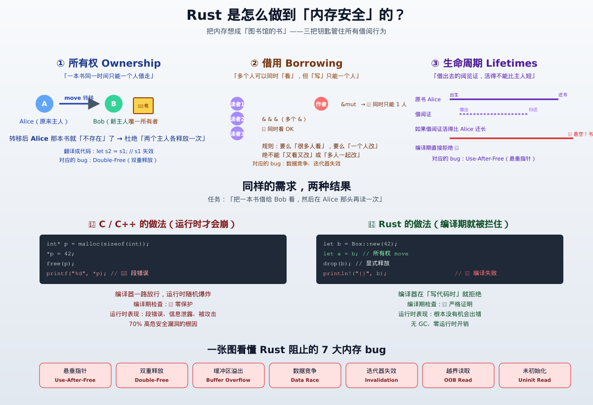

# Rust 内存安全机制详解 —— 编译期所有权系统深度剖析

> 面向人群：已掌握 C/C++，希望从 **机制原理层** 理解 Rust 是如何在**编译期**阻止悬垂指针、重复释放、数据竞争、用后释放、双重释放、迭代器失效等内存灾难的系统软件工程师
> 目标：把"所有权 / 借用 / 生命周期"这套内存安全机制的**底层原理、与 C/C++ 的差异、关键边界条件**讲清楚，能在代码评审、架构讨论、面试中讲明 "Rust 是怎么做到的、有没有做不到的地方"
> 配套阅读：[`Rust-语言详解-车载与系统软件视角.md`](./Rust-语言详解-车载与系统软件视角.md) 是更宏观的 Rust 全景，本文聚焦 **内存安全一个纵深话题**

---

## 写在前面：为什么单独写一篇"内存安全"？

[`Rust-语言详解-车载与系统软件视角.md`](./Rust-语言详解-车载与系统软件视角.md) 提到过一句关键话：

> "Rust 在系统级编程领域 **首次把'内存安全'做成语言级默认**。"

但这句话在 C/C++ 老司机听来往往带着怀疑：

- "所有权那套是真的编译期保证，还是靠运行时检查蒙混过关？"
- "借用检查器会不会反过来让我写不成代码？"
- "`unsafe` 一开就破功了？"
- "如果真那么安全，Linux 内核为什么要小心到给每个 Rust 提交加额外审查？"

本文不做"科普式列举"，而是按 **问题 → 原理 → 代码 → 边界 → C/C++ 对照** 的顺序，把这套机制剖到能让你给别人讲明白为止。读完你应该能回答这些问题：

1. 所有权转移（move）到底在编译期做了什么？
2. 借用检查器的"非词法生命周期（NLL）"是怎么算出来的？
3. 为什么 `Rc<RefCell<T>>` 在多线程里会编译失败？
4. `unsafe` 真的"绕过了安全"吗？还是只是把责任转交给程序员？
5. Rust 阻止了哪些内存 bug？又有哪些它阻止不了（甚至纵容）的内存 bug？

---



> **一图速览**：把内存想成「图书馆的书」—— Rust 用三把钥匙管住所有借阅行为
> - ① **所有权**：一本书同一时间只能一个人借走，杜绝「双重释放」
> - ② **借用**：可以很多人同时「看」，但「写」只能一个人，杜绝「数据竞争、迭代器失效」
> - ③ **生命周期**：借出去的阅览证，活得不能比主人长，杜绝「悬垂指针（Use-After-Free）」
>
> 下面 16 个章节把这套机制的原理、与 C/C++ 的差异、关键边界条件完整讲透。

---

## 目录

1. [问题的全景：内存 bug 为什么这么难？](#1-问题的全景内存-bug-为什么这么难)
2. [核心三大支柱：所有权、借用、生命周期](#2-核心三大支柱所有权借用生命周期)
3. [Move 语义：所有权的转移](#3-move-语义所有权的转移)
4. [借用与借用检查器](#4-借用与借用检查器)
5. [生命周期：引用的有效期证明](#5-生命周期引用的有效期证明)
6. [Copy 与 Clone：类型分类的边界](#6-copy-与-clone类型分类的边界)
7. [智能指针家族：把所有权延伸到堆上](#7-智能指针家族把所有权延伸到堆上)
8. [内部可变性：编译期规则 vs 运行时规则](#8-内部可变性编译期规则-vs-运行时规则)
9. [Send / Sync：把线程安全也做进类型系统](#9-send--sync把线程安全也做进类型系统)
10. [Unsafe Rust：边界的真实位置](#10-unsafe-rust边界的真实位置)
11. [Rust 阻止了哪些内存 bug？](#11-rust-阻止了哪些内存-bug)
12. [Rust 阻止不了（甚至纵容）的内存 bug](#12-rust-阻止不了甚至纵容的内存-bug)
13. [与 C/C++ 内存安全机制的全方位对比](#13-与-cc-内存安全机制的全方位对比)
14. [车载场景下的实践启示](#14-车载场景下的实践启示)
15. [常见误解与反直觉点](#15-常见误解与反直觉点)
16. [速查：让借用检查器开心的 12 条经验](#16-速查让借用检查器开心的-12-条经验)

---

## 1. 问题的全景：内存 bug 为什么这么难？

### 1.1 C/C++ 内存 bug 的真实成本

Microsoft、Chrome、Android、Linux 内核团队近 10 年的安全报告反复得出一个相同数字：

> **所有高危安全漏洞中，约 70% 是内存安全问题。**

这些内存 bug 在 C/C++ 里可分为 7 大类：

| 类别 | 英文 | 一句话定义 | 典型症状 |
|---|---|---|---|
| 悬垂指针 | Use-After-Free (UAF) | 访问已释放的内存 | 读旧值 / 崩溃 / 提权 |
| 双重释放 | Double-Free | 同一块堆内存被 `free()` 两次 | 堆破坏 / 任意代码执行 |
| 缓冲区溢出 | Buffer Overflow | 写到数组边界之外 | 栈破坏 / RCE |
| 越界读取 | Out-of-Bounds Read | 读取数组边界之外 | 信息泄露 |
| 未初始化内存 | Uninitialized Read | 使用未初始化的栈/堆变量 | 数据泄漏 / 行为不确定 |
| 迭代器失效 | Iterator Invalidation | 遍历时容器结构被改 | 读垃圾值 / 崩溃 |
| 数据竞争 | Data Race | 多线程无同步读写同一地址 | 撕裂值 / 崩溃 / 难复现 bug |

### 1.2 为什么编译器不能在 C/C++ 里挡住这些 bug？

答案不是"编译器不够聪明"，而是 **C/C++ 的类型系统从设计之初就不携带生命周期信息**：

```c
// C 代码：编译器完全不知道 raw_ptr 是不是还活着
int* raw_ptr = malloc(sizeof(int));
free(raw_ptr);
printf("%d\n", *raw_ptr);   // UAF：编译器不会报错，因为类型是裸 int*
```

编译器看到的是 `int*`——一个 32/64 位的地址值。它不知道：

- 这块内存的所有者是谁
- 它什么时候被分配的、什么时候被释放的
- 还有没有别处持有它的指针
- 哪些线程正在读写它

把这些信息补上，就叫 **"带内存安全的类型系统"**。Rust 的选择是：直接做进语言的核心模型里，C/C++ 的选择是：留给程序员、运行时库（ASan/MSan/TSan）、静态分析工具（Coverity、Clang SA）。

### 1.3 历史上其他语言怎么解决？

| 语言 | 思路 | 代价 |
|---|---|---|
| Java / Go / Python | 垃圾回收器（GC）自动回收 | GC 停顿无法用于硬实时；占用更多内存 |
| C / C++ | 程序员手动管 | 灵活但 bug 满天飞 |
| Rust | **所有权 + 借用检查器 + 生命周期标注**，编译期证明 | 学习曲线陡，某些模式写不出 |

Rust 的关键创新是：**不引入运行时（无 GC），但仍能在编译期拒绝所有悬垂指针和大多数数据竞争**。

---

## 2. 核心三大支柱：所有权、借用、生命周期

Rust 的内存安全由 **三个互相咬合的机制** 共同支撑：

```
┌──────────────────────────────────────────────────────────────┐
│                     Rust 内存安全的三大支柱                     │
├──────────────────────────────────────────────────────────────┤
│                                                              │
│   ① 所有权 Ownership       —— 谁拥有这块内存？答案是唯一变量  │
│   ② 借用 Borrowing         —— 借出去期间，原主人不能改也不能丢 │
│   ③ 生命周期 Lifetimes     —— 借出去的东西，活得不能比主人短   │
│                                                              │
│   三者共同由 "借用检查器 (Borrow Checker)" 在 MIR 层执行       │
│                                                              │
└──────────────────────────────────────────────────────────────┘
```

### 2.1 三句话总览

| 支柱 | 一句话规则 | 在编译期的体现 |
|---|---|---|
| 所有权 | 每个值有且只有一个所有者变量 | move 后原变量失效（变成"未初始化态"） |
| 借用 | 同一时刻只能有一个 `&mut` 或任意多个 `&`（不能并存） | 借用检查器拒绝"读写共存"或"多写共存" |
| 生命周期 | 引用的生命周期不能超过被引用值的生命周期 | 编译器在每个引用上挂一个"存活区间" |

把这三条规则严格执行下来，就能从类型论层面证明（不是经验性"测过没崩"）：

> **任何一段内存，最多只有一个可写引用活着，或者只有任意多个只读引用活着，并且所有引用的存活区间不超过原值的存活区间。**

这就是 Rust 的安全保证——一个**编译期可证明的命题**，而不是运行时测试出来的。

---

## 3. Move 语义：所有权的转移

### 3.1 基本规则

Rust 默认行为：**赋值、传参、返回** 都是 **move（移动）**，而不是 C 风格的"复制"。

```rust
fn main() {
    let s1 = String::from("hello");   // s1 拥有堆上的 "hello"
    let s2 = s1;                     // 所有权 move 到 s2
    println!("{}", s1);              // ❌ 编译错误：s1 已经 "失效"
}
```

错误信息（中文环境）：

```
error[E0382]: borrow of moved value: `s1`
 --> src/main.rs:4:20
  |
2 |     let s1 = String::from("hello");
  |         -- move occurs because `s1` has type `String`
3 |     let s2 = s1;
  |              -- value moved here
4 |     println!("{}", s1);
  |                    ^^ value borrowed here after move
```

### 3.2 Move 在编译期做了什么？

很多人误以为 Rust 在运行时做了"无效化标记"。**完全不是**——`s1` 在 move 后直接进入编译期的 **"未初始化状态"（uninitialized binding）**，对应的内存（栈槽）在 `s2` 离开作用域时由 `drop(s2)` 释放一次，**不会有重复释放**。

伪代码（编译器的视角）：

```
s1 = String::from("hello")  ; 栈: [s1 → heap("hello")]
s2 = s1                     ; 栈: [s1: 失效, s2 → heap("hello")]
println!(s1)                ; 编译期拒绝：s1 是失效绑定
... 函数返回 ...             ; drop(s2) 释放 heap("hello")，s1 的栈槽被忽略
```

对比 C++：

```cpp
std::string s1 = "hello";
std::string s2 = s1;          // 拷贝：堆上现在有两份 "hello"
std::cout << s1 << "\n";      // OK：s1 还有效
// 函数结束：s1 和 s2 各释放一次堆，编译器/Glibc 妥善处理
```

C++ 默认是 **深拷贝**，Rust 默认是 **移动**——这一字之差，决定了 Rust **没有"不必要的内存分配"**，又靠"原变量失效"杜绝了 **use-after-free** 和 **double-free**。

### 3.3 所有权转移的几种触发场景

| 触发动作 | 是否 move | 备注 |
|---|---|---|
| `let b = a;` | move（默认） | `a` 失效 |
| `let b = a;` | 复制 | 仅当 `a` 是 `Copy` 类型（见 §6） |
| `foo(a)` 传参 | move | 函数接管所有权 |
| `return a;` | move | 返回值接管所有权 |
| `a.foo()` 方法调用 | move | 当方法接收 `self` 而非 `&self` |
| `let b = &a;` | **借用**（不转移） | `a` 仍持有所有权 |
| `let b = &mut a;` | **可变借用** | `a` 仍持有所有权，但被独占借用 |

### 3.4 移动后还能不能"复活"？

可以。**重新赋值**就能让变量重新持有值：

```rust
let s1 = String::from("hello");
let s2 = s1;             // s1 失效
let s1 = String::from("world");   // ✅ s1 重新持有新值
println!("{}", s1);      // OK
```

这是 Rust 解决"借用检查器闹脾气"的常见招数，业内叫 **shadowing + rebind**，是合法的内存安全操作——因为新值是新分配，原来的 `s2` 该怎么 drop 还怎么 drop，互不干扰。

---

## 4. 借用与借用检查器

### 4.1 两类借用

```rust
let mut x = 5;
let r1 = &x;       // 不可变借用 (shared borrow)：可以有任意多个
let r2 = &x;       // ✅ 多个 & 同时存在
let r3 = &mut x;   // ❌ 在 r1, r2 还活着时不能有 &mut
*r3 = 10;          // 通过 &mut 修改
```

借用检查器的不变量（**Aliasing XOR Mutability**，别名与可变性互斥）：

> **在任意给定时间点，对一个值，要么有任意多个 `&T` 共享借用，要么有恰好一个 `&mut T` 可变借用。**

这条规则同时回答了三个问题：

| 内存 bug 类型 | 为什么被这条规则阻止 |
|---|---|
| 迭代器失效 | 遍历时不能 `&mut` 同一个容器（多个 `&` 在世时不能 mutate） |
| 数据竞争 | `&mut` 独占意味着同一时刻不会有第二个读写方 |
| 别名写撕裂 | 多个指针同时写同一地址被静态拒绝 |

### 4.2 借用检查器的工作阶段

```
   源代码 (HIR)
       │
       ▼
   类型检查 (ty::typeck)         → 算出每个表达式的类型
       │
       ▼
   MIR (Mid-level IR)             → 把代码降级为更简单的控制流图
       │
       ▼
   借用检查 (borrowck / NLL)     → 在 MIR 上跑数据流分析
       │
       ▼
   MIR 优化 + 代码生成
```

**关键点**：借用检查在 **MIR（中间表示）** 层执行，而不是直接在 AST 上。这意味着它能精确知道每个借用在 **哪条控制流路径** 之后就不再被使用——这就是 2018 Edition 引入的 **非词法生命周期（NLL, Non-Lexical Lifetimes）**。

#### NLL 的示例

```rust
fn main() {
    let mut s = String::from("hello");
    let r1 = &s;
    let r2 = &s;
    println!("{} {}", r1, r2);
    // r1, r2 在这里之后就不再被使用 → 借用检查器自动结束它们的生命周期
    let r3 = &mut s;
    r3.push_str(" world");
    println!("{}", r3);
}
```

在 NLL 之前（≤ Rust 2015 词法生命周期版本），这段代码会报错，因为 `r1, r2` 词法上"还没离开作用域"。NLL 之后，借用检查器看到 `r1, r2` 的 **最后一次使用** 在 `println!` 那一行，就在那之后结束它们的生命周期，于是 `r3` 合法。

### 4.3 借用冲突的具体表现

```rust
fn main() {
    let mut v = vec![1, 2, 3];
    let first = &v[0];          // 不可变借用 v
    v.push(4);                  // ❌ 错误：&mut 借用与现有 & 冲突
    println!("{}", first);
}
```

错误：

```
error[E0502]: cannot borrow `v` as mutable because it is also borrowed as immutable
  --> src/main.rs:4:5
   |
3  |     let first = &v[0];
   |                  -- immutable borrow occurs here
4  |     v.push(4);
   |     ^^^^^^^^^ mutable borrow occurs here
5  |     println!("{}", first);
   |                  ----- immutable borrow later used here
```

为什么这个规则有意义？`v.push(4)` 可能导致 `vec` **重新分配底层数组**——如果允许，`first` 就会变成悬垂指针。借用检查器直接挡掉了这种潜在 UAF。

### 4.4 两类借用的类型签名表达

```rust
fn inspect(v: &Vec<i32>)           { /* 只读 */ }
fn modify(v: &mut Vec<i32>)        { /* 可写独占 */ }
fn consume(v: Vec<i32>)            { /* 接管所有权 */ }
```

调用方一眼能看出函数对参数的权限——这是 Rust **API 即文档**特性的源头。

---

## 5. 生命周期：引用的有效期证明

### 5.1 为什么需要显式生命周期？

当编译器无法从签名推断出"返回的引用活得和哪个参数一样久"时，必须显式标注：

```rust
fn longest<'a>(x: &'a str, y: &'a str) -> &'a str {
    if x.len() > y.len() { x } else { y }
}
```

`'a` 表示"返回值的生命周期，是 `x` 和 `y` 生命周期的交集"。调用方拿到的结果，必须保证 **不超过 `x` 和 `y` 中较短的那个**。

### 5.2 生命周期子类型（outlives / 'a: 'b）

```rust
fn pick<'a, 'b>(x: &'a str, y: &'b str) -> &'a str
where
    'a: 'b,                         // 'a 至少和 'b 一样长
{ x }
```

`'a: 'b` 读作 "`'a` outlives `'b`"，是生命周期上的子类型关系。这套偏序让函数可以声明"我的返回值活得跟那个参数一样久"。

### 5.3 借用检查器实际在算什么？

每个引用在 MIR 中都携带一个 **loan（借用记录）**，记录：

- 被借用的路径（place）
- 借用种类（`Shared` / `Mutable`）
- 借用的活跃区间（哪些程序点之间这个借用是活跃的）

活跃区间的计算规则（NLL 之后）：

> 一个借用的活跃区间 = 从创建点到 **最后一次使用**（last use）之间的区间。

活跃区间确定后，借用检查器跑两轮：

1. **构造期检查**：确认每个 `&mut` 借用与现有借用 **不冲突**
2. **活跃期检查**：确认任何借用的活跃区间 **不超过** 被引用值的生命周期

两轮都通过，引用才能编译通过。

### 5.4 生命周期省略规则（Lifetime Elision）

为了让 90% 的代码不必手写生命周期，编译器有三条省略规则：

1. **输入省略**：每个未标注的输入引用参数获得独立生命周期
   `fn foo(x: &str, y: &str)`  →  `fn foo<'a, 'b>(x: &'a str, y: &'b str)`
2. **单输入省略**：若只有一个输入引用，该生命周期赋给所有输出引用
   `fn foo(x: &str) -> &str`  →  `fn foo<'a>(x: &'a str) -> &'a str`
3. **方法省略**：若方法有 `&self` 或 `&mut self`，`self` 的生命周期赋给所有输出引用
   `impl Foo { fn bar(&self) -> &str }`  →  `impl Foo { fn bar<'a>(&'a self) -> &'a str }`

只有当这三条规则都不足以推断出输出引用的生命周期时，编译器才**强制要求**显式标注。

---

## 6. Copy 与 Clone：类型分类的边界

### 6.1 Copy 类型：move 退化成 bitwise 复制

```rust
let x = 5;        // i32 实现了 Copy
let y = x;        // 不是 move，而是 bitwise 拷贝
println!("{}", x); // ✅ x 仍然有效
```

实现了 `Copy` trait 的类型在赋值时**不会触发移动**。Rust 的隐式规则：

- 所有**纯栈类型**（数字、bool、char、引用本身、`&T`、`&mut T`、函数指针、`(T1, T2, ...)` 当所有字段都 Copy）
- **自动**实现 Copy

含有堆内存或资源句柄的类型（`String`、`Vec<T>`、`Box<T>`）**不能**实现 Copy——否则会导致"两个变量各自 drop 同一块堆内存"的 double-free。

### 6.2 Clone trait：显式深拷贝

```rust
let s1 = String::from("hello");
let s2 = s1.clone();   // 显式深拷贝：堆上有两份 "hello"
println!("{} {}", s1, s2);  // ✅ 两者都有效
```

`Clone` 是程序员显式调用的、可能昂贵的拷贝操作；`Copy` 是隐式的、必须便宜的位复制。

### 6.3 决策表

| 类型示例 | 是否 Copy | 原因 |
|---|---|---|
| `i32`, `u8`, `f64` | ✅ | 纯栈值 |
| `bool`, `char` | ✅ | 纯栈值 |
| `&T`, `&mut T` | ✅ | 引用本身是 8 字节 |
| `(i32, i32)` | ✅ | 字段都 Copy |
| `String` | ❌ | 拥有堆内存 |
| `Vec<T>` | ❌ | 拥有堆内存 |
| `Box<T>` | ❌ | 拥有堆内存 |
| `Cell<i32>` | ❌ | 含 `UnsafeCell`，不可 Copy |
| `*const T` (裸指针) | ✅ | 同引用，但**不保证安全** |

---

## 7. 智能指针家族：把所有权延伸到堆上

### 7.1 总览

| 智能指针 | 所有权语义 | 典型用途 |
|---|---|---|
| `Box<T>` | 独占堆所有权 | 把递归类型 / 大对象搬上堆 |
| `Rc<T>` | 共享不可变所有权（单线程） | 图结构、配置树 |
| `Arc<T>` | 共享不可变所有权（多线程） | 多线程共享只读数据 |
| `Weak<T>` | 不计入所有权计数的弱引用 | 打破循环引用 |
| `Cow<'a, T>` | Clone-on-Write | 既能借用又能拥有的"懒拷贝" |
| `Pin<P>` | 钉住值，保证不被移动 | 自引用结构、async future |

### 7.2 Box<T>：独占堆所有权

```rust
let b = Box::new(5);
println!("{}", b);    // 自动解引用
```

`Box<T>` 离开作用域时，`drop` 会释放堆上的 `T`。等价于 C++ 的 `std::unique_ptr<T>`，但 Rust 在语言层面强制"唯一所有者"，所以连 `Box::clone()` 都没有——想做共享，请换 `Rc` 或 `Arc`。

### 7.3 Rc<T> / Arc<T>：共享所有权

```rust
use std::rc::Rc;
let a = Rc::new(5);
let b = Rc::clone(&a);   // 引用计数 +1
println!("{} {}", a, b);
```

`Rc<T>` 内部维护一个引用计数：

- `Rc::clone(&a)` 增加计数（O(1)，不深拷贝数据）
- `Rc` 离开作用域时计数 -1
- 计数归零时释放底层 `T`

`Arc<T>` 与 `Rc<T>` 接口相同，区别是 **原子地**增减计数（`std::sync::atomic`），可跨线程。

注意：Rust **不允许**直接通过 `Rc<T>` 获得 `&mut T`——因为可能有别的 `Rc` 持有同一份数据。改写需求请用 `Rc<RefCell<T>>`（见 §8）。

### 7.4 Weak<T>：打破循环

`Rc` 持有环会导致泄漏（计数永远不为 0）。`Weak<T>` 是 **不计数** 的引用，只能升级回 `Rc`，升级失败时返回 `None`。

```rust
use std::rc::{Rc, Weak};
struct Node { value: i32, parent: Weak<i32>, children: Vec<Rc<i32>> }
```

父节点用 `Weak` 引用子节点的父，避免 `父 → 子 → 父` 的环。

### 7.5 Pin<P>：钉住值，防移动

`Pin<Box<T>>` 保证 `T` 一旦放置，**永远不会被移动**——这对 async future（自引用结构）和 intrusive 数据结构至关重要。

```rust
use std::pin::Pin;
let mut boxed = Box::new(String::from("hello"));
let pinned: Pin<&mut String> = Pin::new(&mut *boxed);
pinned.push_str(" world");   // ✅ 可以原地修改
// pinned 的内容绝对不能被换到另一块地址
```

---

## 8. 内部可变性：编译期规则 vs 运行时规则

"内部可变性（Interior Mutability）"是 Rust 引入的一类特殊类型，它**绕过编译期的借用规则**，把可变性的检查挪到 **运行时**。

### 8.1 为什么需要它？

有些场景必须在**不可变引用上**修改数据：

- 共享配置（多个读者偶尔需要写）
- mock 对象用于测试
- `RefCell` 用于需要"延迟可变性"的递归数据结构

```rust
use std::cell::RefCell;
let shared = RefCell::new(5);
let r1 = shared.borrow();           // 运行时借用计数 +1
let r2 = shared.borrow();           // ✅ 多个不可变借用 OK
// let w = shared.borrow_mut();     // ❌ 运行时会 panic：已有借用
```

`RefCell<T>` 把"同一时刻只能一个 `&mut` 或多个 `&`"的规则从编译期移到运行时——违反时返回 `Result::Err` 或直接 panic。

### 8.2 Cell<T> / RefCell<T> / Mutex<T> 对照

| 类型 | 借用语义 | 检查时机 | 线程安全 |
|---|---|---|---|
| `Cell<T>` | **不返回引用**，通过 `get`/`set` 整体替换 | 编译期：要求 `T: Copy` | ❌ |
| `RefCell<T>` | 返回 `Ref<T>` / `RefMut<T>`，运行时借用计数 | 运行时，违反时 panic | ❌ |
| `Mutex<T>` | 同 `RefCell`，但跨线程 | 运行时 + 操作系统同步原语 | ✅ |
| `RwLock<T>` | 多读单写 | 运行时 + OS | ✅ |
| `AtomicI32` 等 | 无锁原子操作 | 硬件原子指令 | ✅ |

经典组合：

```rust
// 单线程共享 + 可改
type SharedVec = Rc<RefCell<Vec<i32>>>;

// 多线程共享 + 可改
type SharedVecMT = Arc<Mutex<Vec<i32>>>;
```

### 8.3 内部可变性 ≠ 绕过 Rust 安全保证

关键：`Cell` / `RefCell` / `Mutex` 内部用了 `UnsafeCell<T>`——这是 Rust 标准库里 **唯一** 允许"通过 `&` 触发 `Unsafe` 行为"的类型。它把"借用规则运行时化"，但 **不是**"放弃借用规则"。

```rust
// RefCell 的简化核心（标准库实现精神）
pub struct RefCell<T: ?Sized> {
    borrow: Cell<BorrowFlag>,
    value: UnsafeCell<T>,
}
```

读到这里你应该意识到一个深层事实：**Rust 的安全保证不是"零 unsafe"，而是"unsafe 被限制在最小核心里、且语义清晰"**。

---

## 9. Send / Sync：把线程安全也做进类型系统

Rust 把 **"能否跨线程移动 / 共享"** 也做成 trait：

```rust
pub unsafe auto trait Send {}     // T 能被 move 到另一个线程
pub unsafe auto trait Sync {}     // &T 能被多个线程同时持有
```

- 大多数类型**自动**实现 `Send` 和 `Sync`
- 含有 `Rc<T>`、`RefCell<T>`、裸指针的类型**默认不** `Send`/`Sync`

```rust
use std::rc::Rc;
fn require_send<T: Send>() {}
let r = Rc::new(5);
require_send::<Rc<i32>>();   // ❌ 编译错误：`Rc<i32>` 不是 `Send`
```

为什么这样设计？

- `Rc<T>` 用非原子计数，跨线程增减会数据竞争
- `RefCell<T>` 的借用计数也非线程安全

换 `Arc<T>` / `Mutex<T>` 即可通过编译：

```rust
use std::sync::{Arc, Mutex};
let r = Arc::new(Mutex::new(5));
require_send::<Arc<Mutex<i32>>>();   // ✅
```

### 9.1 "自动 trait + 手动否定"模式

```rust
// 让某个类型编译期拒绝跨线程
struct NotThreadSafe(std::rc::Rc<i32>);

// 显式取消 Send / Sync（unsafe 但常见）
impl !Send for NotThreadSafe {}
impl !Sync for NotThreadSafe {}
```

这是 Rust 的 **negative trait 实现**，编译器会拦截任何把 `NotThreadSafe` 跨线程的尝试。

### 9.2 数据竞争的编译期阻止

```rust
use std::thread;
let mut v = vec![1, 2, 3];
thread::spawn(move || v.push(4));   // v 被 move 进新线程
thread::spawn(move || v.push(5));   // ❌ v 已经被上一行 move 了
```

或者：

```rust
let mut v = vec![1, 2, 3];
let h1 = thread::spawn(|| v.push(4));   // closure 捕获 v 的引用
let h2 = thread::spawn(|| v.push(5));   // ❌ v 已被 & 借用
```

任何"两个线程同时 `&mut` 同一变量"的尝试都被编译器挡住——不是靠 `pthread_mutex_lock`，是 **类型论证明**。

---

## 10. Unsafe Rust：边界的真实位置

### 10.1 `unsafe` 开启了什么？

```rust
unsafe {
    // 五种被禁用的"超能力"：
    1. 解引用裸指针 (*const T / *mut T)
    2. 调用 unsafe 函数或方法
    3. 访问或修改 mutable static
    4. 实现 unsafe trait
    5. 访问 union 的字段
}
```

`unsafe` **没有**关闭借用检查器、**没有**关掉生命周期检查、**没有**关掉 `Send`/`Sync` 检查。它只允许上面五件事——这些是编译器**无法**证明安全、必须由人来保证的操作。

### 10.2 真实世界里 `unsafe` 用在哪？

| 用途 | 占比 | 例子 |
|---|---|---|
| FFI（调 C 库） | 高 | `libc::malloc`, `winapi::*` |
| 性能敏感的内核 | 中 | `Vec::push` 的扩容逻辑 |
| 标准库自身 | 极高 | `String`, `Vec`, `HashMap` 内部全是 `unsafe` |
| 自引用结构 | 低 | 一些 intrusive 容器、async runtime |

Vec 的扩容（简化）：

```rust
impl<T> Vec<T> {
    pub fn push(&mut self, value: T) {
        if self.len == self.capacity { self.grow(); }
        unsafe {
            ptr::write(self.as_mut_ptr().add(self.len), value);
            self.len += 1;
        }
    }
}
```

`ptr::write` 是 unsafe 的：编译器不知道 T 是不是 `Copy`，也不知道那块地址是否初始化过。Vec 维护了不变量（`len` 之前的元素都已初始化）来让这个 unsafe 实际安全。

### 10.3 `unsafe` 与"安全抽象"

Rust 的设计哲学是 **"unsafe 集中在小核、安全封装在外壳"**：

```
┌──────────────────────────────────────┐
│  用户代码（safe Rust）               │  ← 大多数应用代码
├──────────────────────────────────────┤
│  安全封装层（Vec, String, Box, ...） │  ← 少量 unsafe，但 API 是 safe
├──────────────────────────────────────┤
│  unsafe 内核（裸指针操作）           │  ← 标准库内核，必须 unsafe
└──────────────────────────────────────┘
```

所以 `unsafe` 不是"绕开 Rust 安全"，而是 **"在底层写汇编级代码，外面用安全抽象包起来"**。这与 C++ 的"程序员随时可以裸操作内存"有本质区别。

### 10.4 `unsafe` 的真实代价

| 行为 | 安全 Rust | unsafe Rust |
|---|---|---|
| 编译器检查借用 | ✅ | ✅（不变） |
| 生命周期检查 | ✅ | ✅（不变） |
| 解引用裸指针 | ❌ | ⚠️ 需要自己保证正确 |
| 调用 C 函数 | ❌ | ⚠️ 需要自己保证 ABI / 不变量 |
| 数据竞争保护 | ✅ | ❌ 仍保护（`Send`/`Sync` 不变） |

`unsafe` 是 **"局部解除 5 项超能力"**，**不是** "全局关掉安全保证"。

---

## 11. Rust 阻止了哪些内存 bug？

把所有机制叠起来，Rust **在编译期**就能挡住：

| 内存 bug 类型 | 阻挡机制 | 是否完全挡住 |
|---|---|---|
| Use-After-Free | move 后变量失效 / 借用生命周期 | ✅ 编译期 |
| Double-Free | 每个值单一所有者，drop 只发生一次 | ✅ 编译期 |
| 缓冲区溢出 | `Vec`/`String` 的 `get` 返回 `Option`，无自动越界；下标访问**默认 panic**（可写 unsafe 跳过） | ⚠️ 编译期挡住越界 **写**；越界 **读** 在 release 不会 panic（见 §12） |
| 迭代器失效 | 借用规则阻止遍历期间 mutate | ✅ 编译期 |
| 数据竞争 | `&mut` 独占 + `Send`/`Sync` | ✅ 编译期 |
| 悬垂引用 | 生命周期检查 | ✅ 编译期 |
| 未初始化内存 | `MaybeUninit<T>` 强制显式承认；普通变量必须初始化 | ✅ 编译期 |
| 双重释放 | 同上 | ✅ |
| 类型混淆 | 类型系统本身 | ✅ |
| 空指针解引用 | `Option::unwrap()` 仍能 panic，但没有"裸 `NULL`" | ⚠️ `unwrap`/索引越界**运行时 panic**，但栈追踪清晰 |

把这些加起来，**绝大多数内存安全漏洞在编译期就被挡掉**，剩下的少数（边界检查、unwrap panic）有清晰的栈追踪和"这是程序员的逻辑 bug"的可追究性——和 C 的"段错误 + 不知道哪儿坏了"完全不同。

---

## 12. Rust 阻止不了（甚至纵容）的内存 bug

为了客观，必须列出来：

### 12.1 panic 带来的"半崩溃"状态

```rust
let mut v = vec![1, 2, 3];
let _ = v[10];   // panic：index out of bounds
// v 在这里处于"已经扩容但未完成 push"的中间态
```

Rust 的 panic 默认**展开栈（unwind）**，会运行所有活跃变量的 `drop`——这通常是好事，但在以下场景会留隐患：

- **析构函数 panic**（`Drop::drop` 里又触发 panic）→ 程序直接 abort
- **跨 FFI 边界 panic** → 未定义行为（栈展开穿过 C 帧）
- **临界区 panic** → 如果用 `Mutex` 但 panic 时锁未释放 → 死锁/中毒

### 12.2 `unsafe` 自己挖的坑

```rust
let p: *const i32 = std::ptr::null();
unsafe { println!("{}", *p); }   // 解引用空指针：UB
```

`unsafe` 块内的 UB 是程序员的锅——编译器不再保护。

### 12.3 整数溢出（debug 模式 vs release 模式）

```rust
let x: i32 = i32::MAX;
let y = x + 1;   // debug：panic；release：环绕成 i32::MIN（UB 在 C 里）
```

Rust 在 release 模式默认用 `wrapping_*`，整数溢出是定义良好的环绕而非 UB——这比 C++ 强，但仍要求程序员显式使用 `checked_*` / `saturating_*` 才能在所有模式下报错。

### 12.4 逻辑错误（不是内存错误，但常被混淆）

```rust
fn hash_key(k: &str) -> u32 { 0 }   // 永远返回 0：逻辑 bug
```

Rust 的类型系统管不到算法正确性。`unsafe` 滥用还会引出"逻辑正确但内存不安全"的微妙 bug，例如：

- 自定义 `Drop` 实现里改变另一个变量的状态
- `RefCell` 借出的引用被存到生命周期更长的位置

### 12.5 边界索引的"可关闭 panic"

```rust
let v = vec![1, 2, 3];
unsafe { v.get_unchecked(10) }   // 不检查越界：编译器不会报警
```

只要在 `unsafe` 块里用 `get_unchecked`，Rust 不再做边界检查——这是性能优化口子，也是 UB 来源。

---

## 13. 与 C/C++ 内存安全机制的全方位对比

| 维度 | C | C++ | Rust |
|---|---|---|---|
| 内存管理方式 | 手动 `malloc/free` | 手动 + RAII + 智能指针 | 所有权 + 借用 + RAII |
| 内存安全保证 | ❌ 编译期不检查 | ⚠️ 部分通过智能指针 | ✅ **编译期可证明** |
| GC | ❌ 无 | ❌ 无（除非嵌入第三方） | ❌ 无 |
| 数据竞争保护 | ❌ | ❌ | ✅ `Send`/`Sync` |
| 悬垂指针保护 | ❌ | ⚠️ `weak_ptr` 部分 | ✅ |
| 双重释放保护 | ❌ | ⚠️ `unique_ptr` 部分 | ✅ |
| 越界访问 | ❌ | ⚠️ `at()` / `vector<bool>` | ⚠️ 默认 panic，`unsafe::get_unchecked` 跳过 |
| 整数溢出 | UB | UB | release 环绕 / debug panic |
| 生命周期表达 | 无 | 无 | 一等公民（`'a`） |
| API 自带权限信息 | ❌ | ⚠️（约定） | ✅（`&` / `&mut` / owned） |
| 跨语言 FFI | — | — | `extern "C"` 安全侧 + unsafe 内部 |
| 学习曲线 | 平 | 陡 | **最陡** |
| 实时系统可用 | ✅ | ✅ | ✅（无 GC、可预测 drop） |
| 安全关键认证（ISO 26262） | 成熟 | 成熟 | 进展中（Ferrocene 2024-Q4 拿到 ISO 26262 ASIL D 工具链认证） |

一个直观的对比代码片段：

| 任务 | C | C++ | Rust |
|---|---|---|---|
| 写一个不会 UAF 的链表遍历 | 全靠程序员 | `unique_ptr` 循环 | 编译器强制 |
| 在多线程共享配置 | mutex + 程序员小心 | `shared_ptr` + mutex | `Arc<RwLock<T>>` 编译期强制 |
| 自定义分配器 | 函数指针替换 malloc | 模板 / allocator | trait `GlobalAlloc` |

---

## 14. 车载场景下的实践启示

AUTOSAR Adaptive 平台、Rust 与车载的结合点在 [`Rust-语言详解-车载与系统软件视角.md`](./Rust-语言详解-车载与系统软件视角.md) §9 已经讨论过。本节聚焦 **内存安全机制**在车载场景的具体含义：

### 14.1 ECU 软件的两类内存 bug 风险

| 场景 | 风险 | Rust 对应机制 |
|---|---|---|
| 多个 SWC 共享信号 / 内存 | 双重写、读旧值 | `Arc<Mutex<T>>` 编译期强制独占访问 |
| DCM / DEM 缓冲区管理 | 越界、UAF | `Vec<T>` 默认 panic、`Box<T>` 唯一所有者 |
| SOME/IP 序列化 / 反序列化 | 缓冲区溢出、字节序错位 | 类型 + `zerocopy` crate + 显式长度检查 |
| 中断上下文与主循环共享数据 | 撕裂、中断风暴 | `AtomicI32` 或 `Mutex`（注意中断安全） |
| OTA 下载缓冲 | 缓冲区溢出 | `Box<[u8]>` 固定大小 + 显式索引 |

### 14.2 `no_std` + 实时任务

车载 ECU 的实时任务往往不能用标准库（无堆、不可用 `Mutex`）。Rust 的 `no_std` 模式关闭 `std`，但 **所有权、借用、生命周期仍生效**——这是 Rust 在硬实时场景仍然优于 C 的关键。

```rust
#![no_std]
use core::cell::UnsafeCell;     // 无 std 仍可内部可变性（需 unsafe）

struct SharedBuf {
    data: UnsafeCell<[u8; 256]>,
}
unsafe impl Sync for SharedBuf {}    // 程序员承诺：中断安全
```

### 14.3 与 C/C++ 老代码的接口安全

车载 ECU 大量存量 C/C++ 代码，不可能一夕之间重写。Rust 通过 `unsafe extern "C" fn` 提供 FFI，但 **内部仍受 Rust 规则保护**：

```rust
extern "C" {
    fn c_function(buf: *mut u8, len: usize);
}

fn safe_wrapper(buf: &mut [u8]) {
    unsafe { c_function(buf.as_mut_ptr(), buf.len()) }
    // 内部维护"c_function 不会越界"的不变量
}
```

这种"窄接口、宽内部"的模式让 Rust 模块成为 C 海洋中的安全绿洲。

### 14.4 ISO 26262 与工具链认证

- **Ferrocene 24.11**（2024-11）通过 TÜV Süd 认证，拿到 **ISO 26262 ASIL D 工具链认证**
- 编译器本身被认证，意味着用 Ferrocene 编译出的代码在认证流程上 **不需要再做编译器部分的论证**
- AUTOSAR Adaptive 平台已正式把 Rust 列为 **支持语言**（R23-11 起规范文本明确列入）

这些是"工具链层"的支撑，让 Rust 写出的 ECU 软件能进入功能安全论证流程。

---

## 15. 常见误解与反直觉点

### 15.1 "Rust 慢，因为有运行时检查"

**反直觉**：除边界检查（release 默认会优化掉部分）和少数 panic 检查外，Rust **没有运行时开销**。借用检查在编译期完成。`String` 的引用计数只对 `Rc`/`Arc` 存在，普通 `String` 没有计数。

### 15.2 "所有权 = GC"

**错**。GC 在运行时追踪引用并回收；Rust 在编译期**就禁止了多所有者**或**精确表达共享意图**。没有运行时追踪器，没有 STW（stop-the-world）。

### 15.3 "`unsafe` 等于 C 代码"

**错**。`unsafe` 只关闭 5 项超能力，**借用检查、生命周期、Send/Sync、类型系统全部仍然有效**。C 是"默认 unsafe"，Rust 是"默认 safe，局部显式 unsafe"。

### 15.4 "既然 Rust 这么严，写不出复杂数据结构？"

可以。标准库 `Vec`、`HashMap`、`BTreeMap`、`LinkedList` 都是用 `unsafe` + 安全抽象写出来的。`tokio` 的 future、`bytes` crate 的零拷贝 buffer 都是工业级证明。

### 15.5 "Rust 拒绝我的代码，就一定是我错了"

**部分对**。借用检查器在以下情况会"过于严苛"：

- 借用区间过大（早绑定、晚使用）→ 用 NLL + 重构解决
- 自借用模式（split borrow）→ 用 `split_at_mut` 或 `Pin`
- 缓存 / 双向链表 / 自引用结构 → 用 `UnsafeCell` + `Pin`

但 90% 的情况是 **代码真的不安全**，只是程序员没意识到。Linux 内核的 Rust 提交里常见"借用检查器拒绝→思考→承认确实有 bug→重写"。

### 15.6 "RefCell 没运行时开销吧？"

**错**。`RefCell` 每次 `borrow` / `borrow_mut` 都会原子地改计数（虽然单线程下用 `Cell` 而不是原子操作），并且检查冲突。这是把编译期检查挪到运行时的代价。

---

## 16. 速查：让借用检查器开心的 12 条经验

1. **优先让函数返回 owned 值**（`String`、`Vec<T>`），而不是返回 `&str` / `&[T]`。
2. **如果必须返回引用，让它绑到 `&self` 上**，编译器会推断生命周期。
3. **需要可变 + 共享时**：单线程 `Rc<RefCell<T>>`、多线程 `Arc<Mutex<T>>`。
4. **避免长生命周期借用**：把使用集中、提早 drop、重新绑定。
5. **拆分借用**：`v.iter().zip(v.iter().skip(1))` 不行，改用 `v.split_at(mid)` 各持有两半。
6. **内部状态用 `Cell<T>` / `RefCell<T>`**：当需要"在 `&` 上修改"时。
7. **多线程共享 `T` 时确认 `T: Send + Sync`**：编译器会强制。
8. **避免 `&mut` 通过函数参数"穿透"**：`fn foo(x: &mut Vec<i32>)` 是好习惯，但不要传递 5 层。
9. **`unsafe` 块尽量小**：把 unsafe 隔离在 5 行内，外面包 safe 接口。
10. **`Pin<Box<T>>` 用于自引用**：async、future、intrusive list。
11. **克隆要明确**：`s.clone()` 是显式成本，`Rc::clone(&r)` 是低成本引用计数 +1。
12. **生命周期命名约定**：`'a`、`'b` 是局部；`'static` 是全局；结构体字段用 `'a` 表示"活得跟结构体一样"。

---

## 写在最后：内存安全不是银弹，但 Rust 是 30 年来最接近"工程化银弹"的一次

读完本文你应该意识到，Rust 的内存安全保证 **不是魔法，也不是银弹**：

- 它挡不住逻辑 bug、算法 bug、业务 bug
- 它挡不住 `unsafe` 自己写的 UB
- 它挡不住 panic 边界处的微妙状态

但它在**内存与数据竞争这两类历史最悠久、影响最深远的 bug 上**，第一次做到了 **编译期可证明**——并且 **不需要 GC，不需要运行时追踪器**，对实时系统、嵌入式、车载 ECU 都是可行的。

把它和 [`Rust-语言详解-车载与系统软件视角.md`](./Rust-语言详解-车载与系统软件视角.md) 一起读，能更全面地理解为什么 2026 年起 Rust 会被车载、SDV、Linux 内核、Android 系统级代码大规模采用——不是因为它"时髦"，而是因为它**从类型论层面解决了 70% 高危安全漏洞的根因**。

---

## 附录 A：进一步阅读

- [The Rustonomicon（unsafe Rust 黑魔法手册）](https://doc.rust-lang.org/nomicon/)
- [The Rust Reference：类型系统](https://doc.rust-lang.org/reference/type-system.html)
- [Rust 官方：Send / Sync](https://doc.rust-lang.org/nomicon/send-and-sync.html)
- [Ferrocene 24.11 ISO 26262 ASIL D 认证公告](https://ferrous-systems.com/blog/ferrocene-24-11/)
- [Linux Kernel Rust 文档](https://docs.kernel.org/rust/)
- [`Rust-语言详解-车载与系统软件视角.md`](./Rust-语言详解-车载与系统软件视角.md)
- [`MISRA-C-C++-编码规范详解.md`](./MISRA-C-C++-编码规范详解.md)
- [`车企C-C++使用情况详解.md`](./车企C-C++使用情况详解.md)